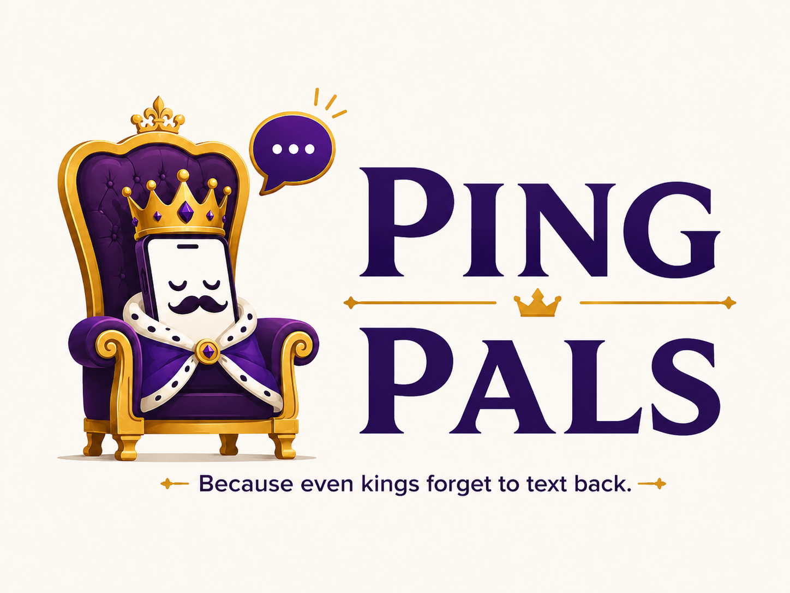

<p align="center">
  
</p>

<h1 align="center">Pingpals</h1>

<p align="center">
  <em>Because even kings forget to text back.</em>
</p>

<p align="center">
  
  
  
  
  
  
</p>

---

## What is Pingpals?

Pingpals is a **single-user relationship-cadence reminder** — a loyal court that nudges you to
stay in touch with the people you choose to track, at a cadence you set per relationship. When
someone is due, Pingpals reminds *you* and hands you a **one-tap deep link** to open the
conversation in your own messaging app.

> **Pingpals never sends messages on your behalf.** It delivers the reminder to you and gets out
> of the way. That boundary is deliberate — it minimizes personal-data exposure, third-party API
> surface, platform terms-of-service risk, and GDPR lawful-basis complexity.

You are the king of your relationships. Pingpals is the butler who never lets a birthday slip.

## Highlights

- 👑 **Per-relationship cadence** — shipped categories (Best Friend, Casual Friend, Family,
  Professional) plus your own, each with a default interval and per-contact overrides.
- 🔔 **Multi-channel reminders** — email, in-app/web push, SMS, WhatsApp, and (self-hosted) Signal,
  each gated by explicit, withdrawable consent.
- 🔗 **Validated one-tap outreach** — `mailto`, `tel`, `sms`, WhatsApp click-to-chat, Signal — every
  link passes an allowlist validator before it can render.
- 🔒 **Secure & private by default** — Zero Trust, fail-closed, per-user isolation, encryption at
  rest, tamper-evident audit log, and full GDPR data-subject rights (export, erasure, retention).
- 📇 **Least-privilege integrations** — contacts read-only (Google People, Microsoft Graph, CardDAV,
  iCloud), Google Calendar free/busy, and opt-in Gmail *metadata-only* last-contact detection.

## The four source-of-truth specs

This repository is **spec-first**. All work cites and obeys these documents — `REQUIREMENTS.md`
wins on any conflict.

| Document | Owns |
| --- | --- |
| [`REQUIREMENTS.md`](./REQUIREMENTS.md) | What the system must do — FR/INT/PRIV/SEC/FE/NFR/TEST requirements |
| [`ARCHITECTURE.md`](./ARCHITECTURE.md) | How it is built — components, data model, tech choices, dependency rules |
| [`SECURITY.md`](./SECURITY.md) | The secure-coding baseline — every rule a fail-closed invariant |
| [`DESIGN.md`](./DESIGN.md) | Brand, palette, typography, and UI guidance |

## Architecture at a glance

A client-only **React 19** SPA talks REST/TLS 1.3 to a **Flask** API — the single trust boundary,
enforcing per-request authorization and strict per-user isolation. An internal Scheduler evaluates
cadence and enqueues reminders to a Delivery worker. Outreach never leaves your device: the API
returns only a validated deep link for the client to open.

```
[React 19 SPA] --REST/TLS1.3--> [Flask API]  (single trust boundary: per-request authz, fail closed)
                                     |
                                     +--> Scheduler --> Delivery worker --> you (email · push · SMS · WhatsApp · Signal)
                                     +--> Outreach-link service (allowlist validator)
                                     +--> Integration adapters (least-privilege OAuth / scoped creds)
                                     +--> Privacy/DSR (consent · export · erasure · retention)
                                     +--> Persistence + KMS + tamper-evident audit log
```

## Repository layout

```
pingpals/
├── api/        Flask / REST API (single trust boundary)   — Python, src-layout
├── web/        React 19 client-only SPA + design tokens    — TypeScript, Vite
├── scripts/    Provider-agnostic CI gate + SBOM scripts
├── issues/     The epic + 79 spec-traced sub-issues
└── *.md        The four authoritative specs (above)
```

## Build status

Bootstrap is underway, one spec-traced issue at a time. ✅ done · ⏳ in progress · ⬜ planned

| Area | Status |
| --- | --- |
| Foundations — monorepo, Docker, CI, SBOM, design tokens, crypto-agility | ✅ |
| Backend — Flask app factory + hardened HTTP boundary | ✅ |
| Backend — validation, authz, CSRF, persistence, KMS, audit, rate-limit | ⏳ |
| Auth — OIDC SSO, sessions, WebAuthn/passkey, OAuth baseline | ⬜ |
| Contacts · Engine · Delivery · Privacy/DSR · Frontend | ⬜ |

## Developer quickstart

> Build/run tooling firms up as the stack lands; today the modules build and test independently.

```bash
# API (Python 3.12+)
cd api
python -m venv .venv && . .venv/bin/activate
pip install --require-hashes -r requirements.lock.txt -r requirements-dev.lock.txt
pip install -e .
pytest                      # unit/integration suite, ≥80% coverage gate

# Web (Node 22+)
cd web
npm ci                      # integrity-verified install
npm test                    # vitest (incl. WCAG-contrast token checks)
npm run build

# Full CI gates (SAST · SCA · secret-scan · coverage), as CI runs them
bash scripts/ci-api.sh
bash scripts/ci-web.sh
```

## Contributing

Every new GitHub issue **must** follow [`REQUIREMENT_TEMPLATE.md`](./REQUIREMENT_TEMPLATE.md) — a
structured, testable requirement. A change is done only when it satisfies its requirement tag and
the in-scope `SECURITY.md` rules, ships tests meeting the ≥80% coverage gate, and passes the CI
gates. See [`CLAUDE.md`](./CLAUDE.md) for the full operating rules.

---

<p align="center"><sub>Noble · Playful · Reassuring — long live the streak. 👑</sub></p>
